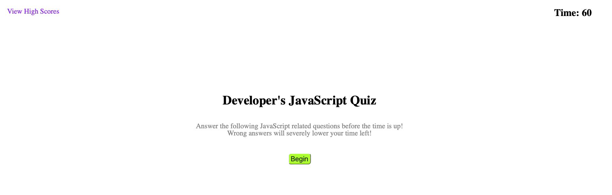
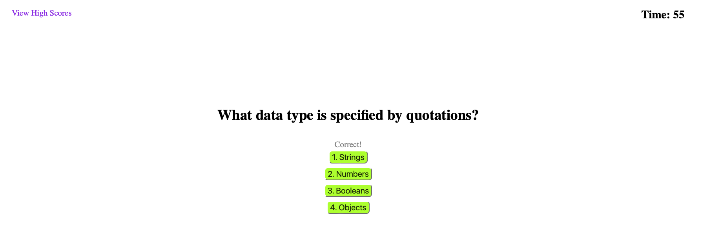
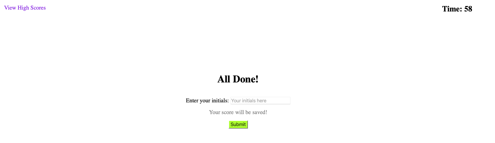
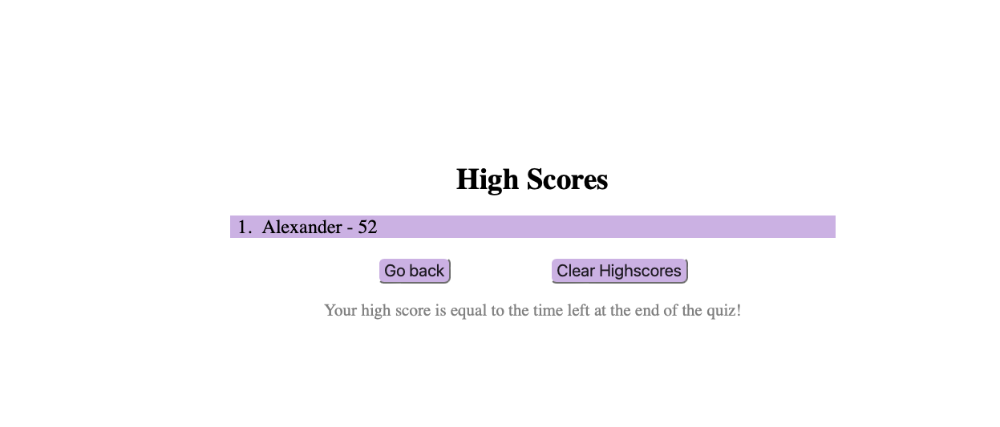

# Developers-Quiz

## Description

- This project was built to further my understanding of using variables and JavaScript alike to write directly to the DOM and make the webpage even more responsive to user feedback and enhance user ability. Building this page also helped me obtain better knowledge of event listeners, data sets, and the time interval in JavaScript. It seemed to be a challenging task at first to build my first webpage that included links to a seperate HTML page but the challenge made it more intriguing and gave me more motivation to take on the task. Overall, the project helped solidify what I continue to learn throughout the course by doing my best to apply all the concepts that have been presented.

## Table of Contents

- [Installation](#installation)
- [Usage](#usage)
- [Credits](#credits)
- [License](#license)

## Installation

N/A

## Usage

- Navigate to: [https://alexanderolivares13.github.io/Developers-Quiz]

- You will be presented with the start page, and will see the "View High Scores" link at the top left of the page, and the timer set to 60 seconds at the top right of the page. Pressing the begin button will present you with the first question and start the timer.

- The page will tell you if you have answered the question correctly or not and will present you with a new question if it was answered correctly

- After you are done answering all the questions, you will be taken to the end page. Here you will be able to enter your name/initials which will be saved and presented on the highscores page.

- In the highscores page you will be able to go back to the start page or you can also clear the high score that is presented

## Credits

- The CSS reset stylesheet that was used is from: [http://meyerweb.com/eric/tools/css/reset/]
- The countdown function in on line 30 in the "script.js" was made by using reference to the mini project from module 04. Just added some extra functionality.

## License

- Please refer to the LICENSE in the repo.